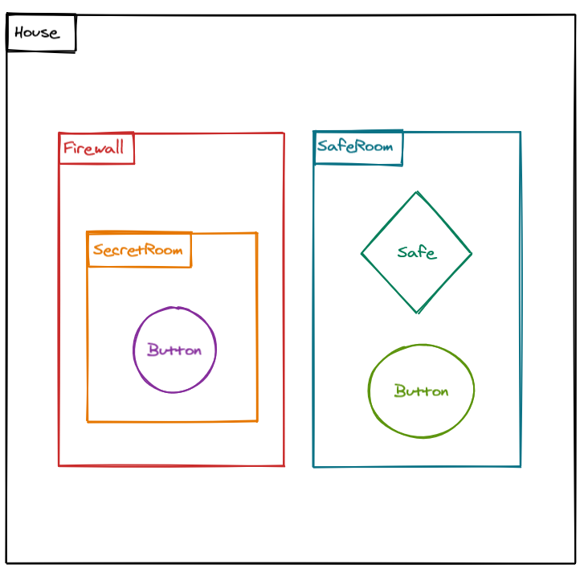

# Easter Exercise

Help! A hacker broke into my home network. Fortunately, nothing was stolen, but unfortunately he or she destroyed the logic how I open my safe.
To be sure that really nothing was stolen, I want to take a quick peek into my `safe`. Please repair my code, so that if I click the `secret button` in my `secret room` the `safe` in my `saferoom` will be opened.
I have already passed my `backupPassword` as a prop to the button component inside the `secret room` for you.
And I also want to let you know that I have a `firewall` around my `secret room`. Please don't forget to add the closing logic for the `close button` next to my `safe` to close the safe again.

This was complicated. To move around quickly inside my house, here is a map of my home.

### `npm start`

Runs the app in the development mode.\
Open [http://localhost:3000](http://localhost:3000) to view it in the browser.

The page will reload if you make edits.\
You will also see any lint errors in the console.
